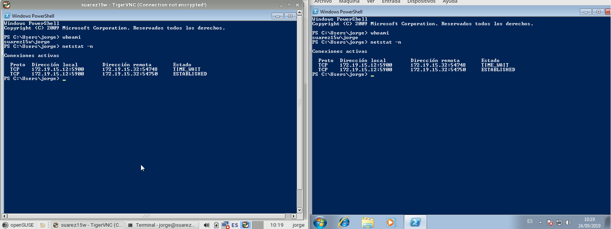

# Acceso remoto VNC

> Este informe es tipo rúbrica, unicamente están las comprobaciones.

---

## 2.1. Comprobación Windows

---

## 4.1. Comprobación OpenSUSE

---

## 5. Comprobaciones con SSOO cruzados

Conectamos el cliente GNU/linux con el Servidor VNC Windows

Conectamos el cliente Windows con el Servidor GNU/Linux.

