# Acceso remoto SSH

---

## Introducción

Necesitaremos 4 MV's con la siguiente configuración

Función      | Sistema Operativo   |      IP        |    Nombre      |
:----------: | :-----------------: | :------------: | :------------: |
Servidor SSH | GNU/Linux OpenSUSE  | `172.19.15.31` | ssh-server15g  |
Cliente SSH  | GNU/Linux OpenSUSE  | `172.19.15.32` | ssh-client15g |
Servidor SSH | Windows Server 2016 | `172.19.15.11` | ssh-server15w  |
Cliente SSH  | Windows7            | `172.19.15.12` | ssh-client15w |

---

## 1. Preparativos

### 1.1. Servidor SSH

**Server OpenSUSE**

Añadimos en `/etc/hosts` los equipos `ssh-client15g` y `ssh-client15w`:

Para comprobar los cambios ejecutamos los siguientes comandos:
  * `ip a`
  * `ip route`

  * `ping 8.8.4.4 -c1`
  * `host www.nba.com`
  * `ping ssh-client15g -c1`

  * `ping ssh-client15w -c1`
  * `lsblk`
  * `sudo blkid`

Tras hacer las comprobaciones, crearemos los siguientes usuarios:
  * `suarez1`
  * `suarez2`
  * `suarez3`
  * `suarez4`

### 1.2. Cliente GNU/Linux

En el cliente GNU/Linux añadimos al fichero `/etc/hosts` los equipos `ssh-server15g` y `ssh-client15w`

Comprobamos que esta bien configurado haciendo ping a ambos equipos:

### 1.3. Cliente Windows

Instalamos software cliente SSh en Windows. Para ello utilizaremos `PuTTy`

Añadimos los equipos`ssh-server15g` y `ssh-client15g` en el fichero `C:\Windows\System32\drivers\etc\hosts`.
  * Comprobamos que esta bien configurado haciendo ping a los dos equipos.

---

## 2. Instalación del servicio SSH

Instalamos el servicio SSH en la máquina ssh-server15g por comandos:
  * Ejecutamos en la terminal `zypper search openssh` para mostrar los paquetes instalados o no con nombre *openssh*.
  * Ahora ejecutamos `zypper install openssh` para instalar el paquete **OpenSSH**.

### 2.1. Comprobación

Desde el propio **ssh-server** verificamos que el servicio esta en ejecución con los siguientes comandos:
  * `systemctl status sshd`
  * `ps -ef | grep sshd`

* Para comprobar que el servicio está escuchando por el puerto 22 [¹](#-servicio-escuchando-por-el-puerto-22-significa-que-el-servicio-utiliza-dicho-puerto-abierto-para-la-respectiva-comunicación-en-la-red) utilizamos el siguiente comando:
  * `sudo lsof -i:22 -n`

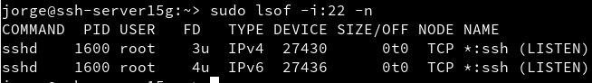

### 2.2. Primera conexión SSH desde cliente GNU/Linux

Vamos al cliente -> `ssh-client15g`
  * Comprobamos la conectividad con el servidor con `ping ssh-server15g -c3`.
  * `nmap -Pn ssh-server15g` para comprobar los puertos abiertos en el servidor (SSH debe estar open). Debe mostrarnos que el puerto 22 está abierto. Si sale una línea como *22/tcp  open  ssh*

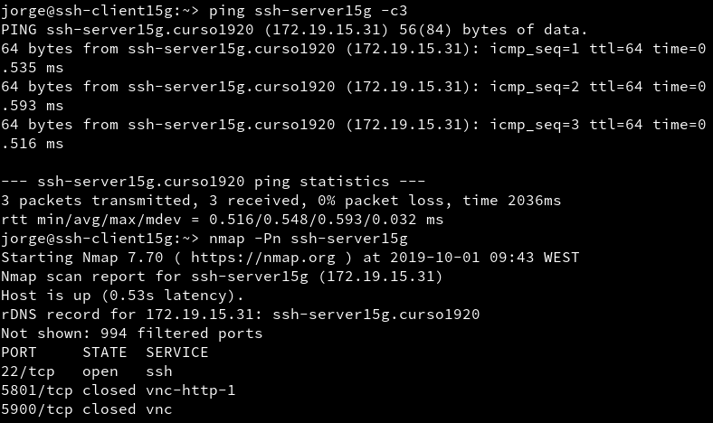

Ahora tras las revisiones previas, comprobamos la conexión ssh usando el usuario `suarez1`
  * Comprobamos que en la primera conexión de SSH hay un intercambio de claves:

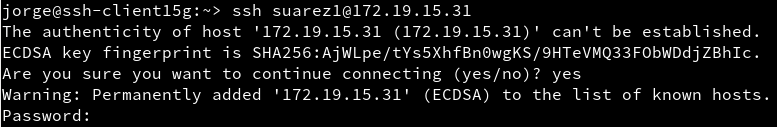

  * Cuando nos volvemos a conectar, ya no hay intercambio porque las claves se alojan en el fichero `known_hosts` que está en la carpeta oculta `ssh`

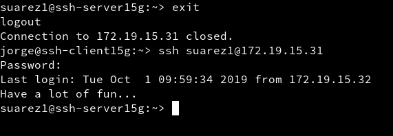

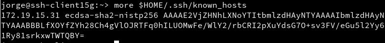

### 2.3. Primera conexión SSH desde el cliente Windows

Desde el cliente Windows nos conectamos usando `PuTTY`.

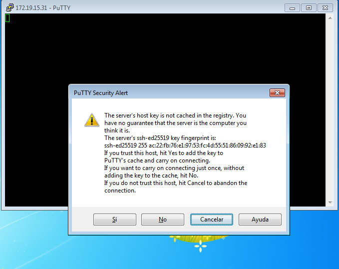

  * No usaremos `Save Settings` para guardar la configuración de la conecxión SSh en los perfiles de *PuTTY*.
  * En la ventana `PuTTY Security Alert`, poner SI grabar las información del servidor.
* La clave que nos aparece es la clave de identificación de la máquina ssh-server.
* Una vez llegado hasta aquí debería conectar correctamente sin intercambio de claves.

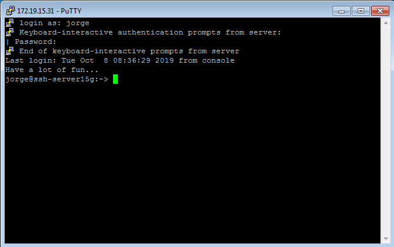

---

## 3. Cambiamos la identidad del servidor

Confirmamos que existen los ficheros `ssh_host*key` y `ssh_host*key.pub`[2](#-ssh_hostkey-y-ssh_hostkeypub-son-los-ficheros-de-clave-públicaprivada-que-identifican-a-nuestro-servidor-frente-a-nuestros-clientes) en `/etc/ssh`.

Modificamos el fichero de configuración SSH (`/etc/ssh/sshd_config`) para dejar una única línea:

~~~
HostKey
/etc/ssh/ssh_host_rsa_key
~~~

Comentamos el resto de líneas con configuración HostKey. Este parámetro define los ficheros de clave pública/privada que van a identificar a nuestro servidor.Con este cambio decimos que sólo vamos a usar las claves del tipo RSA.

### 3.1. Regenerar certificados

Vamos a generar nuevas claves públicas/privadas ara la identificación de nuestro servidor.
  * En **ssh-server15g**, como usuario root ejecutamos: `ssh-keygen -t rsa -F /etc/ssh/ssh_host_rsa_key` y reiniciamos el servidor SSH.

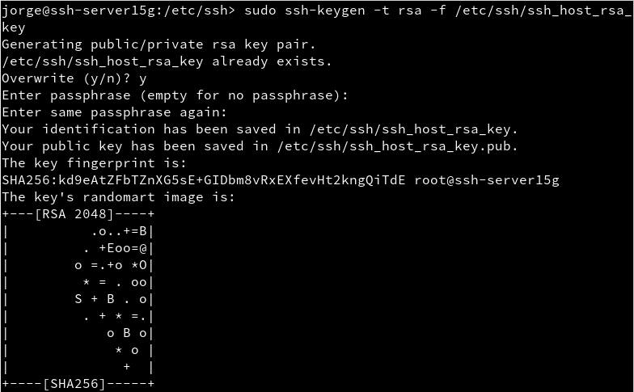

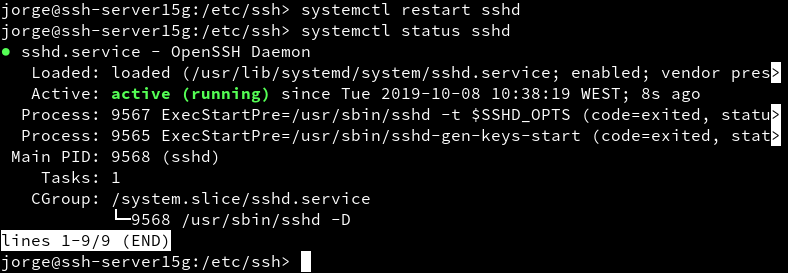

### 3.2. Comprobamos

Ahora comprobamos que sucede al reconectarnos desde los dos clientes.

**OpenSUSE**

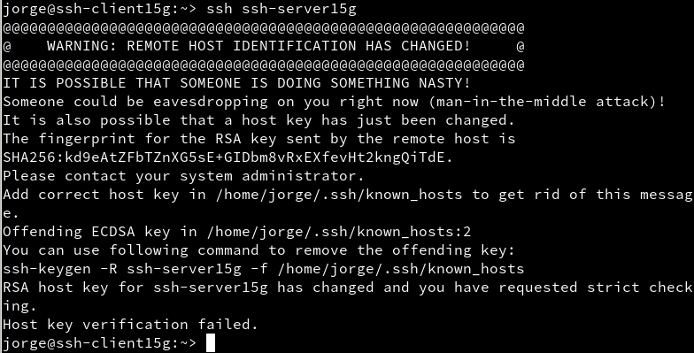

> Con vemos, no se nos conecta porque no coincide la clave para el servidor, así que tendremos que cambiarla.

Para cambiarla ejecutamos el siguiente comando:

~~~console
jorge@ssh-client15g:~> sudo ssh-keygen -t rsa -f /etc/ssh/ssh_host_rsa_key
~~~

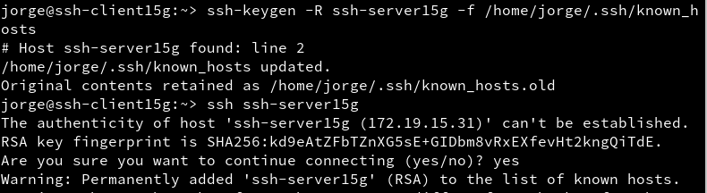

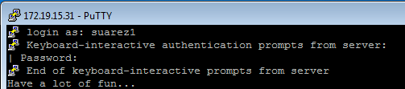

---

## 4. Personalización del prompt Bash

Añadiremos las siguientes líneas al fichero de configuración del `suarez1` en la máquina servidor. (`/home/suarez1/.bashrc`)

~~~console
# Se cambia el prompt al cnectarse vía SSH

if [ -n "$SSH_CLIENT" ]; then
    PS1="AccesoRemoto_\e[32m\u@\h:\e[0m \w\a\$ "
else
    PS1="\[$(pwd)\]\u@\h:\w>"
~~~

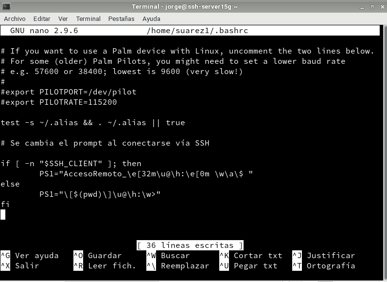

Ademas, crearemos el fichero `/home/suarez1/.alias`, donde pondremos el siguiente contenido:

~~~console
alias c='clear'
alias g='geany'
alias p='ping'
alias v='vdir -cF1'
alias s='ssh'
~~~

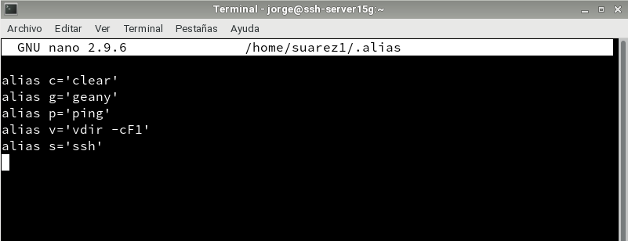

Comprobamos el funcionamiento de la conexión SSH y de el alias que nosotros elijamos.

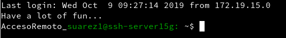

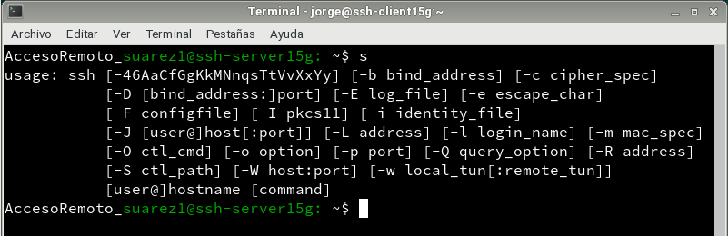

---

## 5. Autenticación mediante claves públicas

* Vamos a la máquina `ssh-client15g`.
* Iniciamos sesión con nuestro usuario, `jorge` en mi caso.
* Con el comando `ssh-keygen -t rsa` generamos un nuevo par de claves para el usuario en:
  * `/home/jorge/.ssh/id_rsa`
  * `/home/jorge/.ssh/id_rsa.pub`

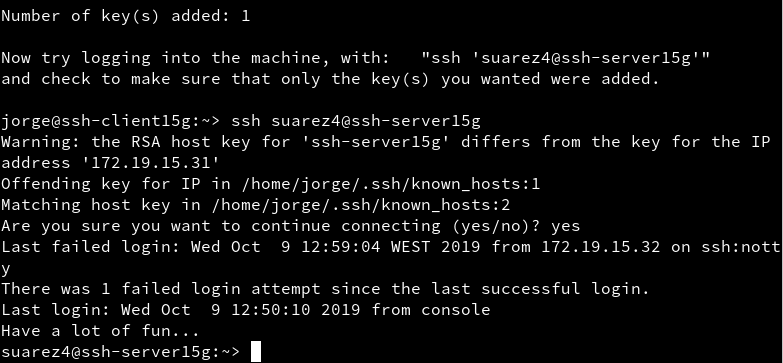

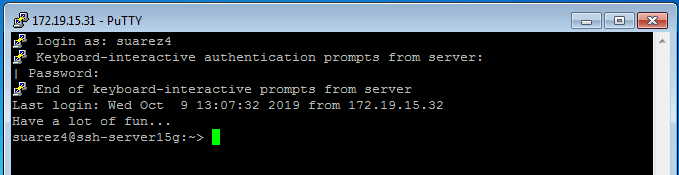

---

## 6. Uso de SSH como túnel para X

* Instalamos en el servidor una aplicación de entorno gráfico que no esté en los clientes, en mi caso `Geany`.
* Modificamos servidor SSH para permitir la ejecución de aplicaciones gráficas desde los clientes. Consultamos el fichero de configuración `/etc/ssh/sshd_config`

Vamos a `ssh-client15g`.
* `zypper se geany`.
* Vamos a comprobar desde ssh-client15g, que funciona geany.
  * `ssh -X suarez1@ssh-server15g`, nos conectamos de forma remota al servidor, y ahora ejecutamos geany de forma remota.

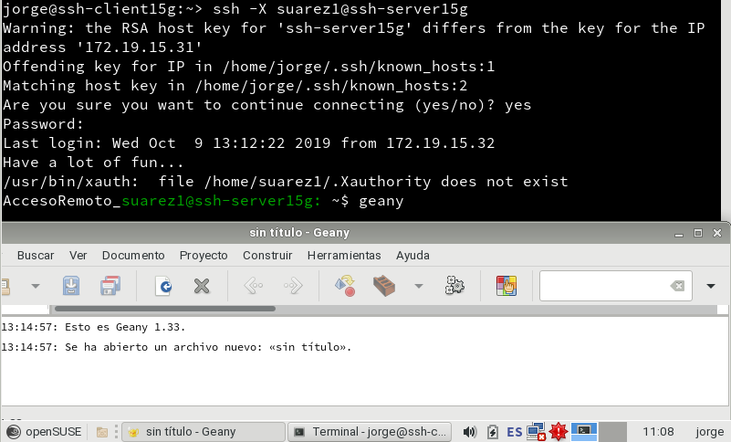

---
#### Notas a pie de página

###### **¹** Servicio escuchando por el puerto 22: *Significa que el servicio utiliza dicho puerto abierto para la respectiva comunicación en la red.*

###### **²** ssh_host*key y ssh_host*key.pub: *Son los ficheros de clave pública/privada que identifican a nuestro servidor frente a nuestros clientes*
