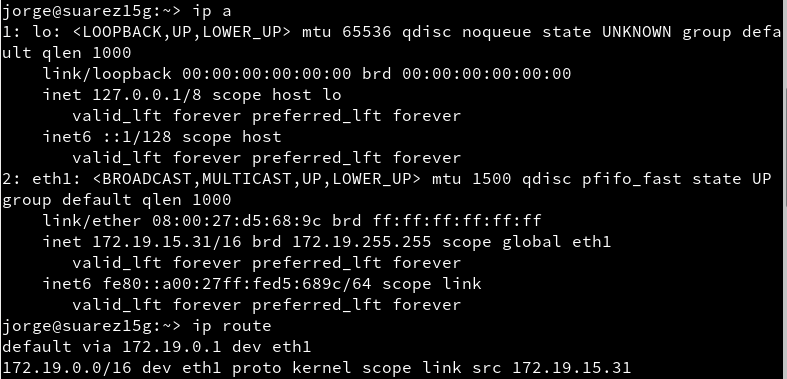
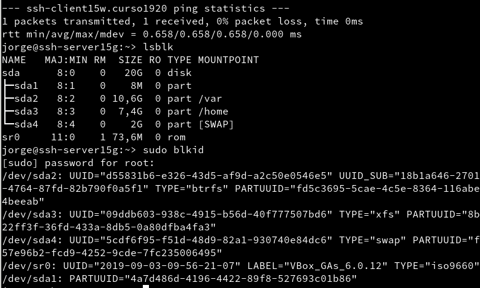
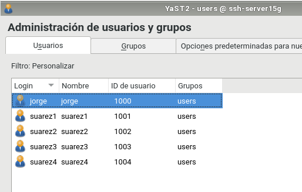
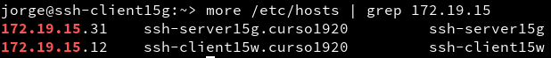
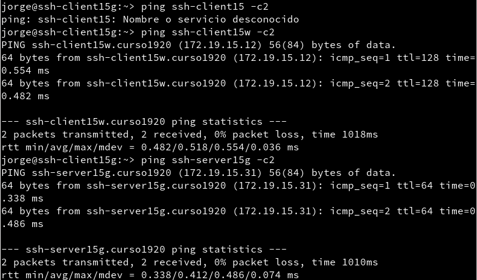
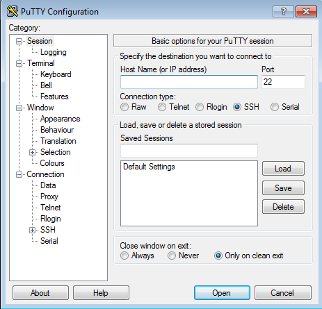

# Acceso remoto SSH

---

## Introducción

Necesitaremos 4 MV's con la siguiente configuración

Función      | Sistema Operativo   |      IP        |    Nombre      |
:----------: | :-----------------: | :------------: | :------------: |
Servidor SSH | GNU/Linux OpenSUSE  | `172.19.15.31` | ssh-server15g  |
Cliente SSH  | GNU/Linux OpenSUSE  | `172.19.15.32` | ssh-client15g |
Servidor SSH | Windows Server 2016 | `172.19.15.11` | ssh-server15w  |
Cliente SSH  | Windows7            | `172.19.15.12` | ssh-client15w |

---

## 1. Preparativos

### 1.1. Servidor SSH

**Server OpenSUSE**

Añadimos en `/etc/hosts` los equipos `ssh-client15g` y `ssh-client15w`:

Para comprobar los cambios ejecutamos los siguientes comandos:
  * `ip a`
  * `ip route`

  * `ping 8.8.4.4 -c1`
  * `host www.nba.com`
  * `ping ssh-client15g -c1`

  * `ping ssh-client15w -c1`
  * `lsblk`
  * `sudo blkid`

Tras hacer las comprobaciones, crearemos los siguientes usuarios:
  * `suarez1`
  * `suarez2`
  * `suarez3`
  * `suarez4`

### 1.2. Cliente GNU/Linux

En el cliente GNU/Linux añadimos al fichero `/etc/hosts` los equipos `ssh-server15g` y `ssh-client15w`

Comprobamos que esta bien configurado haciendo ping a ambos equipos:

### 1.3. Cliente Windows

Instalamos software cliente SSh en Windows. Para ello utilizaremos `PuTTy`

Añadimos los equipos`ssh-server15g` y `ssh-client15g` en el fichero `C:\Windows\System32\drivers\etc\hosts`.
  * Comprobamos que esta bien configurado haciendo ping a los dos equipos.

---

## 2. Instalación del servicio SSH

Instalamos el servicio SSH en la máquina ssh-server15g por comandos:
  * Ejecutamos en la terminal `zypper search openssh` para mostrar los paquetes instalados o no con nombre *openssh*.
  * Ahora ejecutamos `zypper install openssh` para instalar el paquete **OpenSSH**.

### 2.1. Comprobación

Desde el propio **ssh-server** verificamos que el servicio esta en ejecución con los siguientes comandos:
  * `systemctl status sshd`
  * `ps -ef | grep sshd`

* Para comprobar que el servicio está escuchando por el puerto 22 utilizamos el siguiente comando: [¹](#Notaa pie de página)
  * `sudo lsof -i:22 -n`

### 2.2. Primera conexión SSH desde cliente GNU/Linux

### 2.3. Primera conexión SSH desde el cliente Windows

---

## 3. Cambiamos la identidad del servidor

### 3.1. Regenerar certificados

### 3.2. Comprobamos

---

## 4. Personalización del prompt Bash

---

## 5. Autenticación mediante claves públicas

---

## 6. Uso de SSH como túnel para X

---

## 7. Aplicaciones Windows nativas

---

## 8. Restricciones de uso

### 8.1. Restricción sobre un usuario

### 8.2. Restricción sobre una aplicación

---

## 9. Servidor SSH en Windows

---
##### Notas a pie de página

###### Puertos escuchando: Puerto abiertos que usa el ordenador para la respectiva comunicación en la red.
