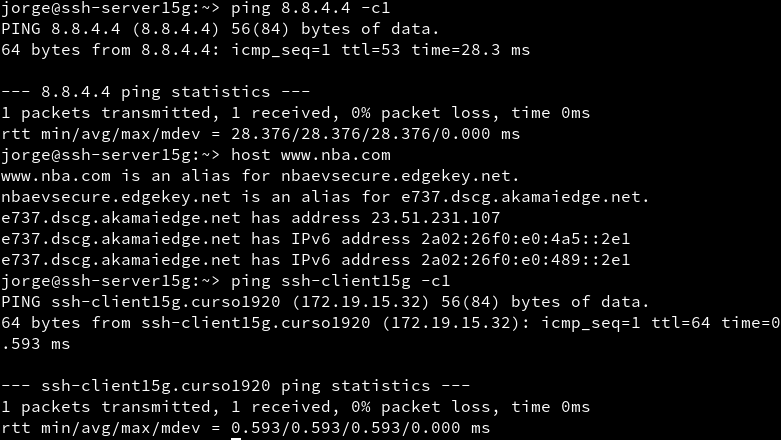
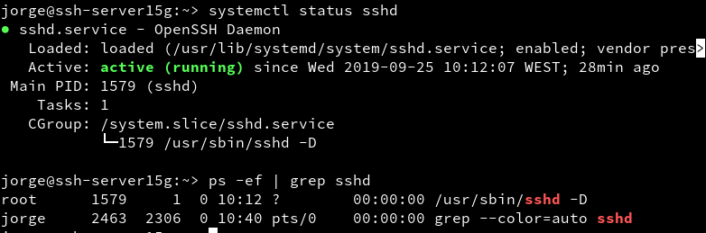
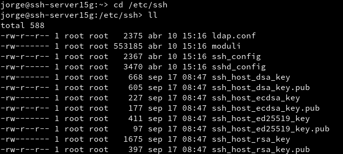

# Acceso remoto SSH

---

## Introducción

Necesitaremos 4 MV's con la siguiente configuración

Función      | Sistema Operativo   |      IP        |    Nombre      |
:----------: | :-----------------: | :------------: | :------------: |
Servidor SSH | GNU/Linux OpenSUSE  | `172.19.15.31` | ssh-server15g  |
Cliente SSH  | GNU/Linux OpenSUSE  | `172.19.15.32` | ssh-client15g |
Servidor SSH | Windows Server 2016 | `172.19.15.11` | ssh-server15w  |
Cliente SSH  | Windows7            | `172.19.15.12` | ssh-client15w |

---

## 1. Preparativos

### 1.1. Servidor SSH

**Server OpenSUSE**

Añadimos en `/etc/hosts` los equipos `ssh-client15g` y `ssh-client15w`:

Para comprobar los cambios ejecutamos los siguientes comandos:
  * `ip a`
  * `ip route`

  * `ping 8.8.4.4 -c1`
  * `host www.nba.com`
  * `ping ssh-client15g -c1`

  * `ping ssh-client15w -c1`
  * `lsblk`
  * `sudo blkid`

Tras hacer las comprobaciones, crearemos los siguientes usuarios:
  * `suarez1`
  * `suarez2`
  * `suarez3`
  * `suarez4`

### 1.2. Cliente GNU/Linux

En el cliente GNU/Linux añadimos al fichero `/etc/hosts` los equipos `ssh-server15g` y `ssh-client15w`

Comprobamos que esta bien configurado haciendo ping a ambos equipos:

### 1.3. Cliente Windows

Instalamos software cliente SSh en Windows. Para ello utilizaremos `PuTTy`

Añadimos los equipos`ssh-server15g` y `ssh-client15g` en el fichero `C:\Windows\System32\drivers\etc\hosts`.
  * Comprobamos que esta bien configurado haciendo ping a los dos equipos.

---

## 2. Instalación del servicio SSH

Instalamos el servicio SSH en la máquina ssh-server15g por comandos:
  * Ejecutamos en la terminal `zypper search openssh` para mostrar los paquetes instalados o no con nombre *openssh*.
  * Ahora ejecutamos `zypper install openssh` para instalar el paquete **OpenSSH**.

### 2.1. Comprobación

Desde el propio **ssh-server** verificamos que el servicio esta en ejecución con los siguientes comandos:
  * `systemctl status sshd`
  * `ps -ef | grep sshd`

* Para comprobar que el servicio está escuchando por el puerto 22 [¹](#-servicio-escuchando-por-el-puerto-22-significa-que-el-servicio-utiliza-dicho-puerto-abierto-para-la-respectiva-comunicación-en-la-red) utilizamos el siguiente comando:
  * `sudo lsof -i:22 -n`

### 2.2. Primera conexión SSH desde cliente GNU/Linux

Vamos al cliente -> `ssh-client15g`
  * Comprobamos la conectividad con el servidor con `ping ssh-server15g -c3`.
  * `nmap -Pn ssh-server15g` para comprobar los puertos abiertos en el servidor (SSH debe estar open). Debe mostrarnos que el puerto 22 está abierto. Si sale una línea como *22/tcp  open  ssh*

Ahora tras las revisiones previas, comprobamos la conexión ssh usando el usuario `suarez1`
  * Comprobamos que en la primera conexión de SSH hay un intercambio de claves:

  * Cuando nos volvemos a conectar, ya no hay intercambio porque las claves se alojan en el fichero `known_hosts` que está en la carpeta oculta `ssh`

### 2.3. Primera conexión SSH desde el cliente Windows

Desde el cliente Windows nos conectamos usando `PuTTY`.

  * No usaremos `Save Settings` para guardar la configuración de la conecxión SSh en los perfiles de *PuTTY*.
  * En la ventana `PuTTY Security Alert`, poner SI grabar las información del servidor.
* La clave que nos aparece es la clave de identificación de la máquina ssh-server.
* Una vez llegado hasta aquí debería conectar correctamente sin intercambio de claves.

---

## 3. Cambiamos la identidad del servidor

Confirmamos que existen los ficheros `ssh_host*key` y `ssh_host*key.pub`[2](#-ssh_hostkey-y-ssh_hostkeypub-son-los-ficheros-de-clave-públicaprivada-que-identifican-a-nuestro-servidor-frente-a-nuestros-clientes) en `/etc/ssh`.

Modificamos el fichero de configuración SSH (`/etc/ssh/sshd_config`) para dejar una única línea:

~~~
HostKey
/etc/ssh/ssh_host_rsa_key
~~~

Comentamos el resto de líneas con configuración HostKey. Este parámetro define los ficheros de clave pública/privada que van a identificar a nuestro servidor.Con este cambio decimos que sólo vamos a usar las claves del tipo RSA.

### 3.1. Regenerar certificados

Vamos a generar nuevas claves públicas/privadas ara la identificación de nuestro servidor.
  * En **ssh-server15g**, como usuario root ejecutamos: `ssh-keygen -t rsa -F /etc/ssh/ssh_host_rsa_key` y reiniciamos el servidor SSH.

### 3.2. Comprobamos

Ahora comprobamos que sucede al reconectarnos desde los dos clientes.

> Con vemos, no se nos conecta porque no coincide la clave para el servidor, así que tendremos que cambiarla.

Para cambiarla ejecutamos el siguiente comando:

~~~
jorge@ssh-client15g:~$
~~~

---

## 4. Personalización del prompt Bash

---

## 5. Autenticación mediante claves públicas

---

## 6. Uso de SSH como túnel para X

---

## 7. Aplicaciones Windows nativas

---

## 8. Restricciones de uso

### 8.1. Restricción sobre un usuario

### 8.2. Restricción sobre una aplicación

---

## 9. Servidor SSH en Windows

---
#### Notas a pie de página

###### **¹** Servicio escuchando por el puerto 22: *Significa que el servicio utiliza dicho puerto abierto para la respectiva comunicación en la red.*

###### **²** ssh_host*key y ssh_host*key.pub: *Son los ficheros de clave pública/privada que identifican a nuestro servidor frente a nuestros clientes*
