# Servidor 389-DS - OpenSUSE

---

## 1. Preparativos

### 1.1. Nombre equipo

> Utilizaremos una MV openSUSE Leap 15

Nuestra máquina se llamará `server15.curso1920`.

Comprobamos con los siguientes comandos que lo hemos configurado correctamente:

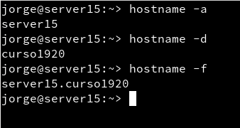

### 1.2. Cortafuegos

Abrimos los puertos en el cortafuegos con:
* `systemctl status firewalld` para comprobar el estado del cortafuegos.
* `firewalld-cmd --permanent --add-port={389/tcp,636/tcp,9830/tcp}` para abrir determinados puertos en el cortafuegos usando la herramienta *firewall-cmd*
* `firewall-cmd --reload` para recargar la confguración del cortafuegos y asegurarnos de que se han leído los nuevos cambios.

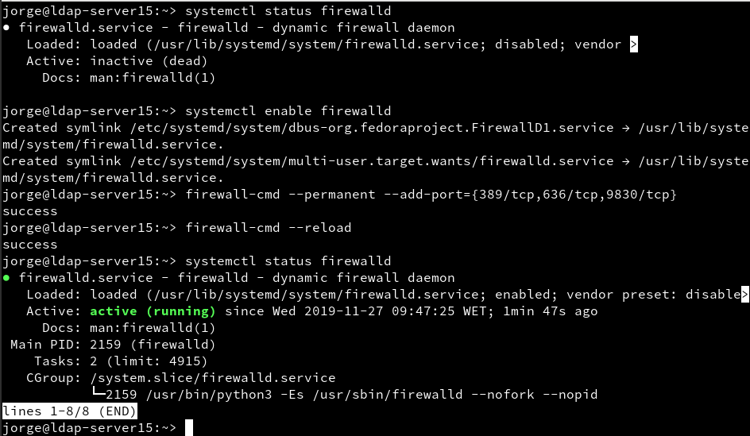

---

## 2. Instalar el Servidor LDAP

### 2.1. Instalación del paquete

Abrimos una consola como **root**

Instalamos el script con `zypper in 389-ds`.
Se nos crea el script en `/usr/sbin/setup-ds.pl`, lo ejecutamos y a continuación iremos respondiendo a las preguntas de configuración del servicio.

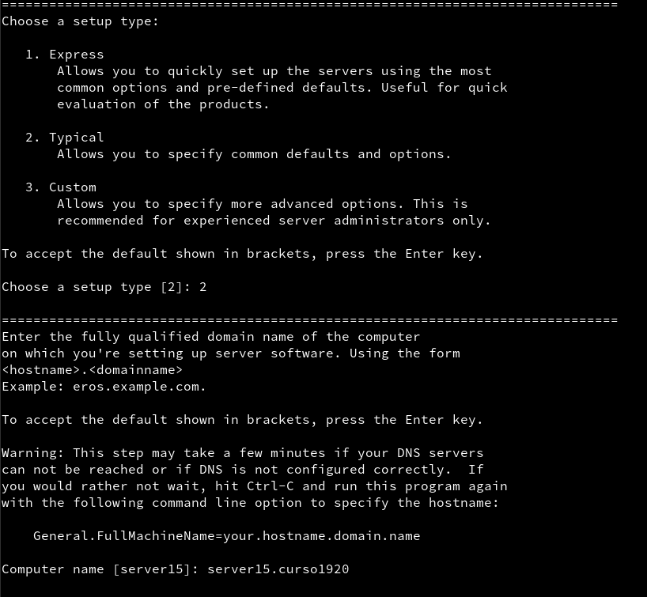
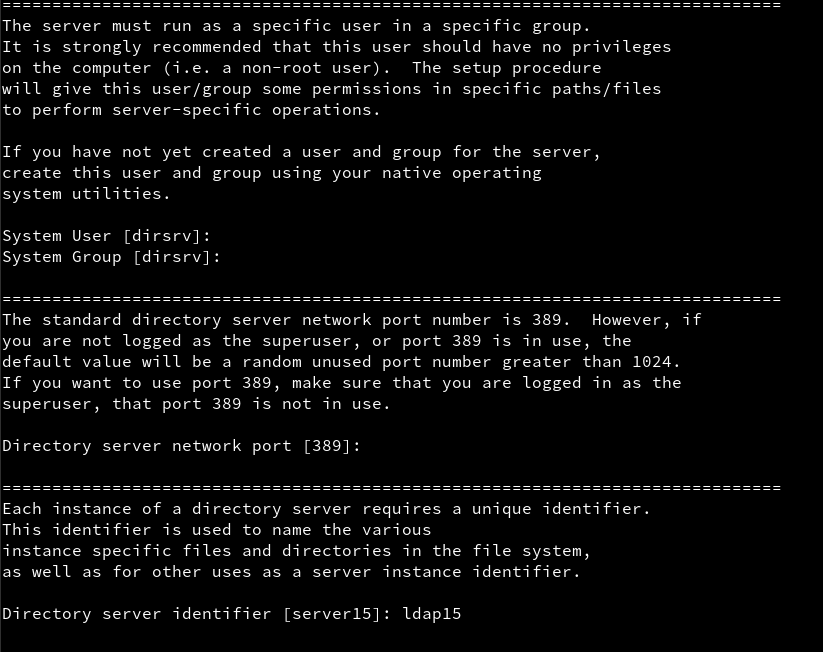
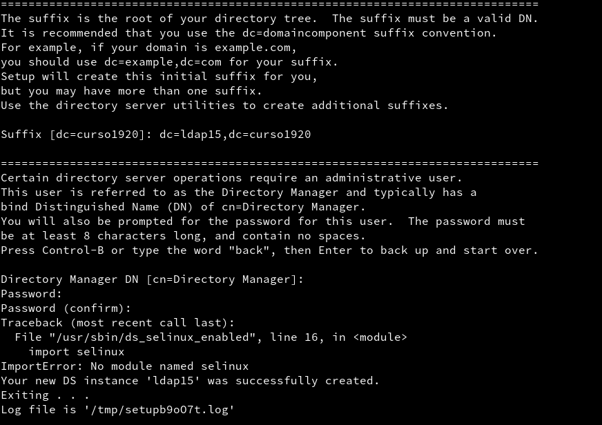

### 2.2. Comprobamos el servicio

`systemctl status dirsrv@ldap15` para comprobar el estado del servicio.


`nmap -Pn server15 | grep -P '389|636'`

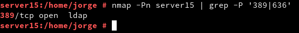

### 2.3. Comprobamos el acceso al contenido del LDAP

| Parámetro                   | Descripción                |
| :-------------------------: | :------------------------: |
| -x                          | No se valida usuario/clave |
| -b "dc=ldap15,dc=curso1920" | Base/sufijo del contenido  |
| -H ldap://localhost:389     | IP:puerto del servidor     |
| -W                          | Se solicita contraseña     |
| -D "cn=Directory Manager"   | Usuario del LDAP           |

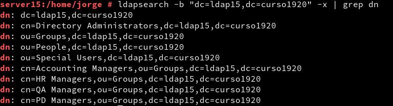

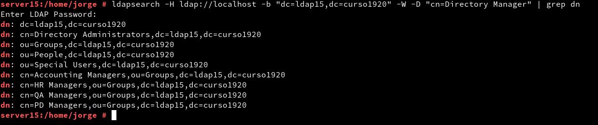

---

## 3. Añadir usuarios LDAP por comandos

### 3.1. Buscar Unidades Organizativas

Las OU `People` y `Gropus` deberían estar creadas. en caso contrario las creamos.

Podemos usar los siguientes parámetros con el comando `ldapsearch` para buscar las OU:

| Parámetro | Descripción                                      |
| --------- | ------------------------------------------------ |
| "(ou=*)"  | Filtro para la búsqueda de UnidadesOrganizativas |
| "(uid=*)" | Filtro para la búsqueda de usuarios              |

> EJEMPLO:
> ldapsearch -H ldap://localhost:389

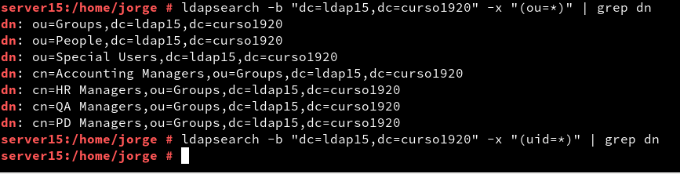

### 3.2. Agregar usuarios

Uno de los usos más frecuentes para el directorio LDAP es para la administración de usuarios. Vamos a utilizar ficheros **ldif** para agregar usuarios.
* Fichero `mazinger-add.ldif` con la información para el crear el usuario `mazinger`.

```
dn: uid=mazinger,ou=people,dc=ldap15,dc=curso1920
uid: mazinger
cn: Mazinger Z
objectClass: account
objectClass: posixAccount
objectClass: top
objectClass: shadowAccount
userPassword: {CLEARTEXT}escribir la clave secreta
shadowLastChange: 14001
shadowMax: 99999
shadowWarning: 7
loginShell: /bin/bash
uidNumber: 2001
gidNumber: 100
homeDirectory: /home/mazinger
gecos: Mazinger Z
```

Tras crear el fichero añadiremos los datos en LDAP con el comando `ldapadd -x -W -D "cn=Directory Manager" -f mazinger-add.ldif`

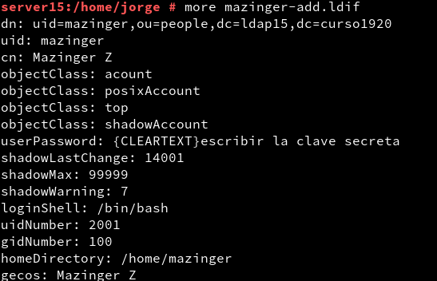

### 3.3. Comprobar el nuevo usuario

Para comprobar si se ha creado el usuario en el LDAP utilizamos el comando `ldapsearch -W -D "cn=Directory Manager" -b "dc=ldap15,dc=curso1920" "(uid=*)"`

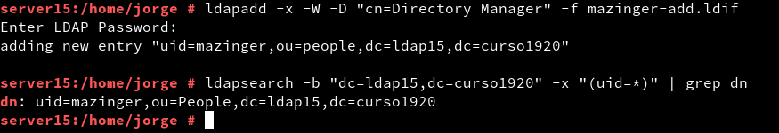

---

## 4. Contraseñas encriptadas

### 4.1. Teoría

* Ejecutar `zypper in openldap2`, para instalar la heramienta `slappasswd` en OpenSUSE.

La herramienta `slappasswd` provee la funcionalidad para generar un valor userPassword adecuado. Con la opción -h es posible elegir uno de los siguientes esquemas para almacenar la contraseña:
* {CLEARTEXT} (texto plano),
* {CRYPT} (crypt),
* {MD5} (md5sum),
* {SMD5} (MD5 con salt),
* {SHA} (1ssl sha) y
* {SSHA} (SHA-1 con salt, esquema por defecto).

**Ejemplo SHA-1**

Para generar un valor de contraseña hasheada utilizando SHA-1 con salt compatible con el formato requerido para un valor userPassword, ejecutar el siguiente comando:

```bash
$ slappasswd -h {SSHA}
New password:
Re-enter new password:
{SSHA}5uUxSgD1ssGkEUmQTBEtcqm+I1Aqsp37
```

**Ejemplo MD5**

También podemos usar el comando `md5sum` para crear claves md5. Ejemplo:

```bash
$ md5sum
clave secreta
43cff9e9a30167a1e383026bf61108f2  -
```

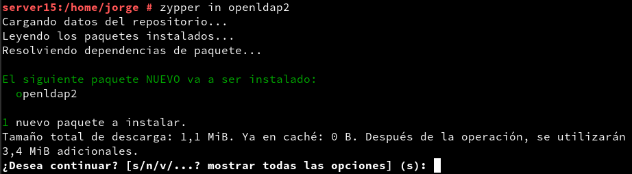

### 4.2. Agregar más usuarios

* Creamos los siguientes usuarios en LDAP:

| Full name       | Login Account | UID  |
| --------------- | ------------- | ---- |
| Koji Kabuto     | koji          | 2002 |
| Boss            | boss          | 2003 |
| Doctor Infierno | drinfierno    | 2004 |

**Koji Kabuto**

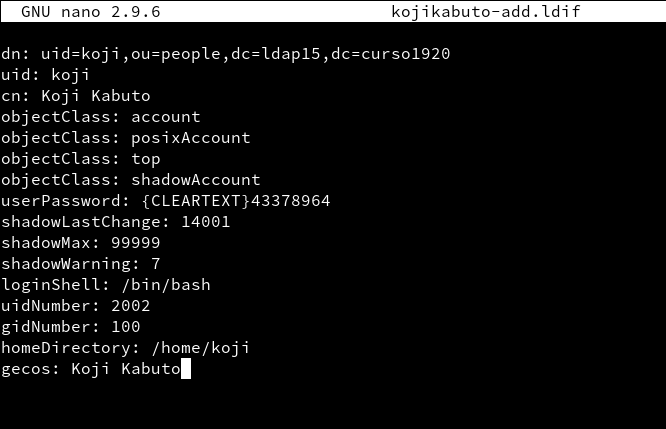

**Boss**

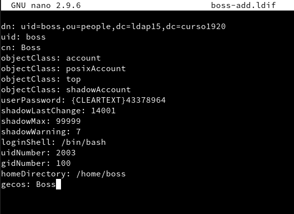

**Doctor Infierno**

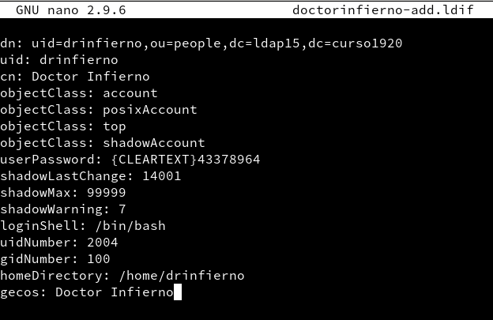

### 4.3. Comprobar los usuarios creados

Consultamos los usuarios LDAP para ver si se han añadido correctamente.

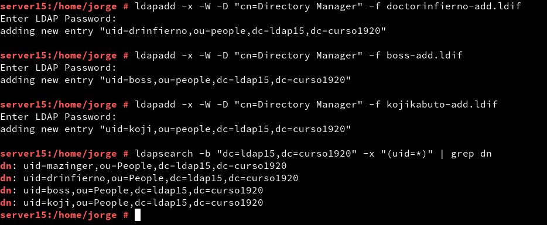
