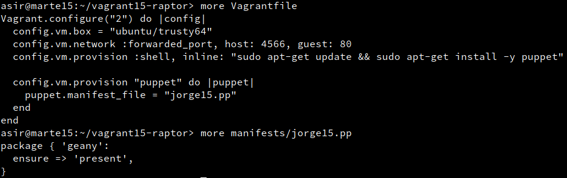
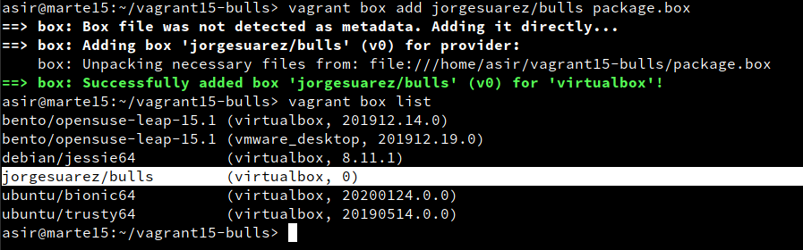

# Vagrant

---

## Comprobando Vagrant

## 1. Proyecto Celtics

**Crear Proyecto Celtics**

**Vagrantfile**

**Levantar máquina**

**Entrar por ssh**

---

## 2. Proyecto Hawks

**Crear Proyecto Hawks**

**Vagrantfile Hawks**

**Redirección de puertos**

**Comprobación**

---

## 3. Proyecto Lakers

**Crear Proyecto Lakers HTML**

**Vagrantfile Lakers**

**Comprobación**

---

## 4. Proyecto Raptors

**Crear proyecto Raptors**

**Vagrantfile Raptors**

**Comprobación Puppet**

---

## 4. Proyecto Bulls

**Preparar máquina**

**Crear Proyecto Bulls**

