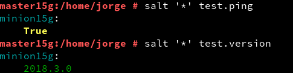
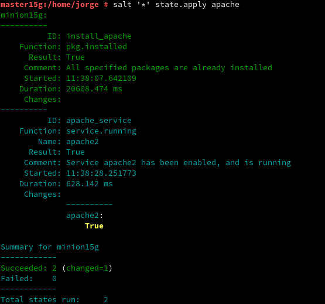

# Salt-stack

---

### 3.4. Comprobamos conectividad

---

## 4. Salt States

### 4.5. Aplicar el nuevo estado

---

## 5. Crear más estados

### 5.1. Crear estado "users"

### 5.2. Crear estado "files"
