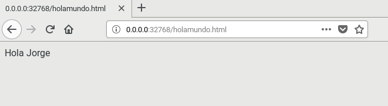
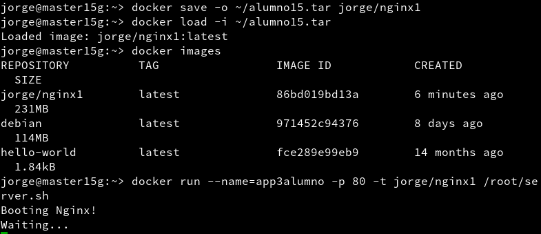
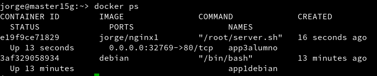
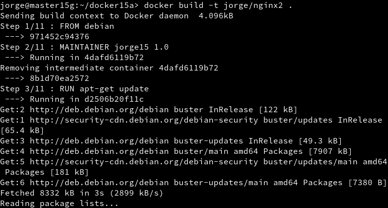
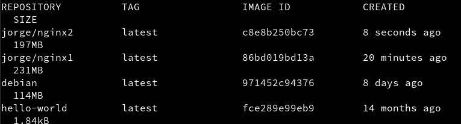
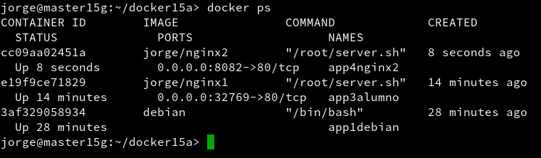
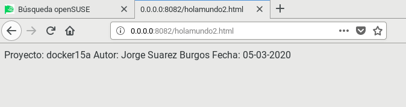

# Docker

---

## 3. Crear contenedor a partir de nuestra imagen

### 3.2. Comprobamos

### 3.3. Migrar la imagen a otra máquina

---

## 4. Dockerfile

### 4.2. Crear imagen a  partir de Dockerfile

### 4.3. Crear contenedor y comprobar

